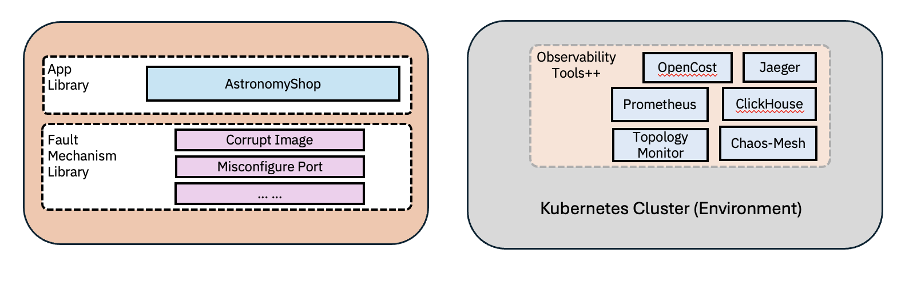

# ITBench for Site Reliability Engineering (SRE) and Financial Operations (FinOps)

**[Paper](https://github.com/IBM/ITBench/blob/main/it_bench_arxiv.pdf) | [Incident Scenarios](./docs/incidents.md) | [Tools](./docs/tools.md)**

## Overview
ITBench uses open source technologies to create completely repeatable and reproducible scenarios on a Kubernetes platform. A SRE scenario involves deploying a set of observability tools, a sample application, and triggering an incident (referred to as task) in the environment.



While this repository focuses on scenarios, an open-source Language Model (LM)-based SRE-Agent that aims to diagnose and remediate issues in these scenario environments can be found [here](https://github.com/IBM/ITBench-SRE-Agent).

### Structure
This project uses [Ansible](https://docs.ansible.com/ansible/latest/getting_started/introduction.html) to automate the deployment and undeployment of technologies to a Kubernetes cluster and the injection and removal of faults.

For those new to Ansible, consider checking out the [documentation](https://docs.ansible.com/ansible/latest/playbook_guide/index.html) for guides and advices.

The playbook run is configured using variables defined in `group_vars`.

| Directory                   | Purpose                                                                                                      |
|-----------------------------|--------------------------------------------------------------------------------------------------------------|
| `roles/tools`               | Handles the deployment and removal of observability/monitoring tools, chaos engineering tools, etc.          |
| `roles/applications`        | Handles the deployment and removal of sample applications                                                    |
| `roles/faults`              | Provides reusable fault injection and removal mechanisms                                                     |
| `roles/incidents`           | Contains scenarios that leverage the fault injection and removal mechanisms defined in the directories above |

## Recommended Software

### MacOS

- [Homebrew](https://brew.sh/)

## Required Software

- [Python3](https://www.python.org/downloads/) (v3.13.Z)
- [Helm](https://helm.sh/docs/intro/install/) (v3.16+)
- [Kubectl](https://kubernetes.io/docs/tasks/tools/)
- [OpenShift CLI](https://docs.redhat.com/en/documentation/openshift_container_platform/4.18/html/cli_tools/openshift-cli-oc) (Required Only for OpenShift)

### Installing Required Software via Homebrew (for MacOS)

1. Install [Homebrew](https://brew.sh/)
2. Install required software
```bash
brew install helm
brew install kubectl
brew install python@3.13
brew install openshift-cli
```

### Installing Required Software (for Red Hat Enterprise Linux -- RHEL)

1. Install Helm by following the instructions [here](https://helm.sh/docs/intro/install/#from-script)
2. Set up kubectl by following the instructions [here](https://kubernetes.io/docs/tasks/tools/install-kubectl-linux/#install-using-native-package-management)
3. Set up Python by running:
```bash
sudo dnf install python3.13
```
4. Install the OpenShift CLI by following the instructions [here](https://docs.redhat.com/en/documentation/openshift_container_platform/4.18/html/cli_tools/openshift-cli-oc#cli-installing-cli_cli-developer-commands)

## Getting Started – Deploying an Incident Scenario

### Installing Dependencies

1. Create a Python virtual environment
```bash
python3.13 -m venv venv
source venv/bin/activate
```

2. Install Python dependencies
```bash
python -m pip install -r requirements.txt
```

**Optional**

_Note: The developer requirements are required in order to lint the playbooks, build the AWX execution environment image, or use the provided playbooks for remote cluster setup. If this functionality is not required, then it is not necessary to install these requirements._

```bash
python -m pip install -r requirements-dev.txt
```

3. Install Ansible collections.
```bash
ansible-galaxy install -r requirements.yaml --force
```

4. Create the relevant environment variable files by running
```bash
make group_vars
```

_Note: These steps only need to be done once upon the initial set up._
_Note: Depending on what kind of cluster setup is needed, further dependencies may need to be installed. Please see the below section for further details._

### Cluster Setup

#### Local Cluster

For instruction on how to create a kind cluster on MacOS, please see the instructions [here](./dev/local_cluster/README.md).
For instruction on how to create a kind cluster on Red Hat Enterprise Linux (RHEL) virtual machine (VM) or bare-metal instance, please see the instructions [here](./dev/local_cluster/README_RHEL.md).

#### Remote Cluster

For instruction on how to create an cloud provider based Kubernetes cluster, please see the instructions [here](./dev/remote_cluster/README.md).

Currently, only AWS is supported. AWS clusters are provisioned using [kOps](https://kops.sigs.k8s.io/).

### Running Incident Scenarios - Quick Start

#### 1. Start the Incident Scenario
Run the following command to deploy observability tools, monitoring stack, chaos engineering tools, application stack, and inject the fault for scenario 1:

```bash
INCIDENT_NUMBER=1 make start_incident
```

#### 2. Set Up Port Forwarding
Enable access to the Prometheus and Jaeger dashboards:

```bash
kubectl port-forward svc/ingress-nginx-controller -n ingress-nginx 8080:80 &
```

#### 3. Access Dashboards
Navigate to the following URLs in your browser:

```bash
# View alerts and metrics
http://localhost:8080/prometheus/alerts

# View traces
http://localhost:8080/jaeger
```

#### 4. Monitor Alert States
The system includes alerts that monitor:
- Deployment status across namespaces
- Service latency metrics
- Error rates across services
- Kafka connection status for messaging components

**Alert Behavior:**
- Default state: `Inactive`
- After a few minutes: `Firing` (indicating fault manifestation)

#### 5. SRE Agent Configuration (Optional)
If using the [SRE-Agent](https://github.com/itbench-hub/itbench-sre-agent), configure your `.env.tmpl` file:

```env
OBSERVABILITY_STACK_URL=http://localhost:8080
TOPOLOGY_URL=http://localhost:8080/topology
```

#### 6. Cleanup
When finished, undeploy by running:

```bash
INCIDENT_NUMBER=1 make stop_incident
```

See the [Developer Guide](./DEVELOPER_GUIDE.md) for a step-by-step breakdown of the `make start_incident` process.

_Note_: For a full list of `make` commands, run the following command:

```bash
make help
```

## Frequently Asked Questions (FAQ)

### Images are not downloading from DockerHub

A few of the tools and applications used by the various software in ITBench requires downloading images from DockerHub. However, DockerHub has [rate limits](https://docs.docker.com/docker-hub/usage/) which will prevent an user from pulling from it after the limit has been exhausted for that IP address until it resets.

One recommended approach for maneuvering around this limit is to creating a Personal Access Token (PAT) and then using it as a secret in Kubernetes.
Steps are as follows:
1. **Login/Create a Docker Hub account** at https://www.docker.com/get-started/
2. **Generate a Personal Access Token (PAT)**:
   - Log into Docker Hub
   - Go to Account Settings → Security
   - Click "New Access Token"
   - Give it a descriptive name
   - Select appropriate permissions ("Public Repo Read" as we are pulling public images)
   - Copy the generated token
3. **Create a Docker Registry Secret in Kubernetes**
    ```bash
    kubectl create secret docker-registry dockerhub-secret \
      --docker-server=https://index.docker.io/v1/ \
      --docker-username=your-dockerhub-username \
      --docker-password=your-access-token \
      --docker-email=your-email@example.com \
      --namespace=your-namespace
    ```
    You will need to repeat the above for the following namespaces:
    - clickhouse
    - clickhouse-operator
    - opensearch
    - opentelemetry-collectors
    - prometheus
